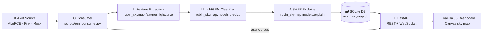

# 🔭 rubin-skymap

> **Real-time astronomical transient classification broker — live ZTF alerts on an equatorial sky-map dashboard.**

Pulls live [ZTF](https://www.ztf.caltech.edu/) alerts from the [ALeRCE](https://alerce.online/) or [Fink](https://api.fink-portal.org) broker APIs, extracts photometric light-curve features, classifies each transient with a **LightGBM** model, explains predictions with **SHAP**, and streams everything to a live sky-map dashboard over WebSocket.

---

## ✨ Features

- 🌌 **Live equatorial sky-map** — real ZTF alert dots plotted by RA/Dec, coloured by class
- ⚡ **Real-time WebSocket streaming** — new alerts appear on the map within seconds
- 🤖 **LightGBM classifier** — 8-class transient taxonomy (SN Ia, SN II, SN Ibc, SLSN, Kilonova, AGN, RRL, Other)
- 🔍 **SHAP explanations** — top-5 feature contributions shown per alert in the inspector
- 🌐 **Dual data sources** — ALeRCE REST API (recommended, no auth) or Fink broker REST API
- 📊 **MLflow tracking** — every training run logged with metrics and artifacts
- 📉 **Drift monitoring** — Kolmogorov–Smirnov scoring against training feature distribution
- 🗃️ **SQLite persistence** — all predictions stored with features and SHAP JSON
- 🐳 **Docker-ready** — single `docker compose up --build` for the API server

---

## 🏗️ Architecture



---

## 📦 Tech Stack

| Layer | Technology |
|---|---|
| Alert ingestion | ALeRCE REST API · Fink REST API · MockSource |
| Feature engineering | NumPy · pandas (15 photometric features) |
| Classifier | LightGBM 4.3 · scikit-learn |
| Explainability | SHAP 0.45 |
| API server | FastAPI 0.111 · Uvicorn · WebSocket |
| Database | SQLite · SQLAlchemy 2.0 |
| MLOps | MLflow 2.14 |
| Frontend | Vanilla HTML5 Canvas + CSS + JS |
| Config | PyYAML · python-dotenv |

---

## 🚀 Quickstart

### Prerequisites

- Python **3.11.9**
- Internet connection (for ALeRCE live data) — or run with `--synthetic` for fully offline

### 1 · Install

```bash
git clone <repo-url> rubin-skymap
cd rubin-skymap

python -m venv .venv
source .venv/bin/activate        # Windows: .venv\Scripts\activate

pip install -r requirements.txt
```

### 2 · One-command launch (recommended)

```bash
./run.sh
```

`run.sh` handles everything automatically:
- Detects if a trained model exists; if not, generates synthetic data and trains one
- Starts the API server on `http://localhost:8000`
- Starts the alert consumer (pulls live ZTF data from ALeRCE)
- Opens the dashboard in your browser

```bash
./run.sh --api-only    # start API server only, skip consumer
./run.sh --stop        # kill all rubin-skymap processes
```

### 3 · Manual launch (step by step)

```bash
# Step 1 — Generate synthetic training data (~2000 objects, no network)
python scripts/download_plasticc.py --synthetic

# Step 2 — Train the LightGBM classifier  →  models/lgbm_v1.txt
python scripts/train_model.py

# Step 3 — Start the API server
uvicorn rubin_skymap.serving.api:app --host 0.0.0.0 --port 8000

# Step 4 — In a second terminal, start the alert consumer
python scripts/run_consumer.py
```

Then open **http://localhost:8000** 🎉

---

## 🌐 Data Sources

### ALeRCE (default — no auth required ✅)

The consumer polls the [ALeRCE ZTF REST API](https://api.alerce.online/ztf/v1) by default.
It cycles through `SN → AGN → VS` classes on each poll cycle so the dashboard receives a
diverse mix of real transients.

```yaml
# configs/dev.yaml
ingest:
  mode: alerce          # ← default
  poll_interval_sec: 8.0
  batch_size: 10
```

### Fink Broker (alternative)

```yaml
# configs/dev.yaml
ingest:
  mode: fink
```

Optionally set credentials in `.env` (copy `.env.example`):

```env
FINK_USER=your_username
FINK_PASSWORD=your_password
```

> Fink credentials are only required for private streams. The public REST API works without them.

### Mock / Offline

```yaml
ingest:
  mode: mock
```

Generates parametric synthetic light curves locally — no network needed. Useful for development and demos.

---

## 🎓 Training on Real PLAsTiCC Data

For a production-quality model, train on the real [PLAsTiCC](https://plasticc.org/) dataset from Zenodo:

```bash
# Download (~500 MB) and convert to parquet
python scripts/download_plasticc.py --real

# Retrain on the real data
python scripts/train_model.py --data data/processed/plasticc_train.parquet
```

Raw files are saved to `data/raw/zenodo/`.  The processed parquet lands at `data/processed/plasticc_train.parquet`.

---

## 🗺️ Dashboard Guide

| Element | Description |
|---|---|
| 🔵 Sky-map dots | Each dot is a classified ZTF alert, coloured by transient class |
| ⚡ Live Alerts sidebar | New alerts stream in real time over WebSocket |
| 🔍 Inspector panel | Click any dot or sidebar row — shows RA/Dec, confidence, SHAP top-5 |
| 🏷️ Class filter bar | Toggle individual classes on/off on the map and list |
| 🟢 / 🔴 Status indicator | Green = live WebSocket connected · Red = reconnecting |

---

## 🔌 API Reference

| Method | Endpoint | Description |
|---|---|---|
| `GET` | `/health` | Health check → `{"status": "ok"}` |
| `GET` | `/api/alerts?limit=200` | Recent predictions from DB (newest first) |
| `GET` | `/api/stats` | Total count, per-class breakdown, drift info |
| `POST` | `/api/predict` | Run inference on a single alert (JSON body) |
| `WS` | `/ws/alerts` | WebSocket stream — new prediction per message |

### Example: POST /api/predict

```bash
curl -X POST http://localhost:8000/api/predict \
  -H "Content-Type: application/json" \
  -d '{
    "object_id": "ZTF21example",
    "ra": 5.5,
    "dec": -10.2,
    "jd": [2459001.5, 2459003.5, 2459007.5, 2459012.5, 2459018.5],
    "mag": [19.1, 18.4, 18.0, 18.3, 18.9],
    "magerr": [0.05, 0.04, 0.03, 0.04, 0.05],
    "filter": ["g", "r", "g", "r", "g"]
  }'
```

---

## 🧪 Tests, Lint & Type Check

```bash
# Run test suite (fully offline — no network required)
pytest -q

# Lint with ruff
ruff check .

# Type check with mypy
mypy rubin_skymap
```

---

## 🐳 Docker

```bash
# Build and start the API container (port 8000)
docker compose up --build
```

The container runs the **API server only**. Run the consumer on the host side:

```bash
python scripts/run_consumer.py
```

> ⚠️ CORS is set to `["*"]` for development. Tighten `server.cors_origins` in `configs/base.yaml` before any production deployment.

---

## 📁 Project Layout

```
rubin-skymap/
├── 📂 configs/
│   ├── base.yaml            # Base configuration (all defaults)
│   └── dev.yaml             # Dev overlay (mode, poll interval, DB URL)
├── 📂 rubin_skymap/         # Main Python package
│   ├── config.py            # YAML loader with deep-merge + dotenv
│   ├── logging_setup.py
│   ├── 📂 ingest/
│   │   ├── alerce_source.py # ALeRCE ZTF REST API source (default)
│   │   ├── fink_source.py   # Fink broker REST API source
│   │   ├── mock_source.py   # Parametric synthetic source
│   │   └── schemas.py       # Alert pydantic schema
│   ├── 📂 features/
│   │   └── lightcurve.py    # 15 photometric feature extractors
│   ├── 📂 models/
│   │   ├── train.py         # LightGBM training pipeline + MLflow
│   │   ├── predict.py       # Inference wrapper
│   │   └── explain.py       # SHAP explainer wrapper
│   ├── 📂 db/
│   │   ├── models.py        # SQLAlchemy ORM models
│   │   └── session.py       # Engine cache + CRUD helpers
│   ├── 📂 serving/
│   │   ├── api.py           # FastAPI routes + WebSocket endpoint
│   │   └── bus.py           # In-process asyncio broadcast bus
│   └── 📂 monitoring/
│       └── drift.py         # KS-drift scoring vs training features
├── 📂 scripts/
│   ├── download_plasticc.py # Synthetic generator + Zenodo downloader
│   ├── train_model.py       # Training entry point
│   └── run_consumer.py      # Consumer loop entry point
├── 📂 frontend/             # Vanilla HTML5 Canvas + CSS + JS dashboard
├── 📂 tests/                # pytest suite (fully offline)
├── 📂 data/
│   ├── raw/                 # Parquet input files
│   └── processed/           # Feature parquets for drift monitoring
├── run.sh                   # One-command launcher
├── Dockerfile
└── docker-compose.yml
```

---

## ⚙️ Configuration Reference

All config lives in `configs/base.yaml` (defaults) overridden by `configs/dev.yaml` (or any file named by `RUBIN_SKYMAP_ENV`).

| Key | Default | Description |
|---|---|---|
| `ingest.mode` | `alerce` | Alert source: `alerce` · `fink` · `mock` |
| `ingest.poll_interval_sec` | `8.0` | Seconds between poll cycles |
| `ingest.batch_size` | `10` | Objects fetched per cycle |
| `ingest.alerce.min_detections` | `5` | Min ZTF detections to include an object |
| `ingest.alerce.min_probability` | `0.0` | Min ALeRCE classifier probability gate |
| `model.num_leaves` | `31` | LightGBM `num_leaves` |
| `model.learning_rate` | `0.05` | LightGBM learning rate |
| `model.n_estimators` | `300` | Max boosting rounds |
| `model.random_state` | `42` | Global random seed |
| `server.port` | `8000` | API server port |
| `db.url` | `sqlite:///./rubin_skymap.db` | SQLAlchemy DB URL |

---

## 🏷️ Transient Classes

| Class | Description |
|---|---|
| 🔴 **SN Ia** | Type Ia thermonuclear supernova — standard candle for cosmology |
| 🟠 **SN II** | Core-collapse supernova with hydrogen envelope — plateau light curve |
| 🟡 **SN Ibc** | Stripped core-collapse supernova — faster, fainter than SN Ia |
| 🟢 **SLSN** | Super-luminous supernova — 10–100× brighter than normal SNe |
| 🔵 **Kilonova** | Neutron star merger — rapid rise, red/infrared colours |
| 🟣 **AGN** | Active galactic nucleus — stochastic long-timescale variability |
| 🩷 **RRL** | RR Lyrae variable star — pulsating, short period, distance indicator |
| ⚪ **Other** | Unclassified / low-confidence detections |

---

## 🌌 Sky Map Assets

The sky-map canvas renders real astronomical data: ~9,000 Hipparcos stars, 88 IAU constellation lines, and a multi-layer animated Milky Way band.

### Generate the assets (one-time setup)

```bash
python scripts/build_sky_assets.py
```

This downloads and parses:
- **Stars** — HYG database (Hipparcos IDs, magnitudes, RA/Dec) → `frontend/data/stars.json`
- **Constellations** — Stellarium `constellationship.fab` + HYG positions → `frontend/data/constellations.json`
- **Milky Way** — Galactic-plane great circle via `astropy` → `frontend/data/milkyway.json`

The three files are committed to the repo and total **~580 KB**. They are served as static files under `/static/data/` by the FastAPI server.

> **Offline fallback** — if the network fetch fails, the script writes a minimal embedded dataset (50 brightest stars, 5 major constellations). The dashboard renders gracefully with whatever data is present; missing files produce an empty sky background without error.

### Milky Way renderer

The galactic band is drawn in **7 stacked canvas passes** on an offscreen canvas, composited with additive (`"lighter"`) blending so it self-illuminates without obscuring stars or alert dots:

| Pass | Effect |
|---|---|
| **L1** | Outer dust haze — enormous warm-amber envelope, `blur(22px)` |
| **L2** | Teal-blue nebula band — mid-width nebulosity, `blur(10px)` |
| **L3** | Golden inner glow — warm density enhancement, `blur(6px)` |
| **L4** | Bright core spine — narrow cool-white nucleus thread, `blur(2px)` |
| **L5** | Dark dust lane — `destination-out` composite punches a shadow through the core |
| **L6** | Scatter particle field — deterministic seeded warm/cool point cloud along the band |
| **L7** | Dual travelling shimmer — blue-white + gold dashed trains at different speeds, alpha modulated by `sin(t)` |

A `requestAnimationFrame` loop drives L7 continuously. The loop starts/stops automatically with the **Milky Way** toggle.

### Real-time UTC clock

A live UTC clock is displayed in the header right section. It ticks every 500 ms with a colon-blink effect and a brief accent-colour pulse each second.

### Sky layer toggles

The legend bar includes four layer toggles:

| Toggle | Default | Controls |
|---|---|---|
| **Milky Way** | on | Full 7-layer animated galactic band |
| **Stars** | on | Hipparcos background stars (size ∝ magnitude, DPR-aware) |
| **Constellations** | on | 88 IAU constellation line segments |
| **Labels** | off | Constellation name text at centroid |

---

## 🐛 Troubleshooting

| Symptom | Fix |
|---|---|
| `Model not found at models/lgbm_v1.txt` | Run `python scripts/train_model.py` (or just `./run.sh`) |
| `Training data not found` | Run `python scripts/download_plasticc.py --synthetic` first |
| Port 8000 already in use | `lsof -ti:8000 \| xargs kill` or change `server.port` in `configs/base.yaml` |
| Sky map is empty | Ensure consumer is running; hit `/api/alerts` — should return ZTF rows |
| Dashboard shows red dot | API server not reachable — dashboard auto-reconnects every 3 s |
| `ModuleNotFoundError: rubin_skymap` | Run all commands from the repo root with venv active |
| Only mock data in dashboard | Check `ingest.mode` is `alerce` in `configs/dev.yaml` and restart consumer |
| All alerts same class | Old mock rows in DB — run `DELETE FROM alerts WHERE object_id LIKE 'MOCK-%'` |

---

## ✅ Reproducibility Checklist

- [x] All random seeds controlled via `model.random_state` in config
- [x] All file paths defined in `configs/base.yaml` — no hardcoded paths in library code
- [x] `requirements.txt` pinned to exact versions
- [x] Synthetic data generation is fully deterministic (seed 42)
- [x] MLflow run logged to `mlruns/` with params, metrics, and artifacts
- [x] Training features saved to `data/processed/features_train.parquet` for drift monitoring
- [x] `RUBIN_SKYMAP_ENV` env var selects config overlay (default: `dev`)

---

## 📄 License

MIT — see [LICENSE](LICENSE.md).
